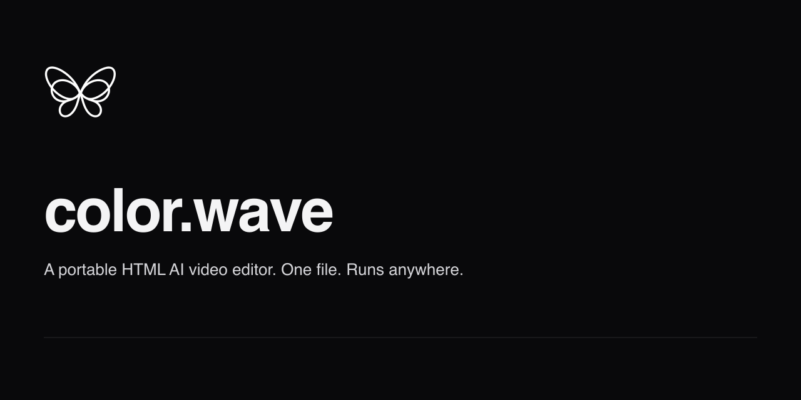

# color.wave

A portable HTML AI video editor. One file. Runs anywhere.

color.wave is a single-file SPA built on the [workbooks](https://github.com/shinyobjectz-sh/workbooks) framework. An LLM agent edits an HTML video composition; a sandboxed iframe renders it; a parsed timeline shows clips with their `data-start` / `data-duration`. State persists in the file itself — open a `.workbook.html` artifact, edit, save, share.

## Quick start

```bash
git clone --recurse-submodules https://github.com/shinyobjectz-sh/color.wave.git
cd color.wave
bun install
bun run build
# → dist/colorwave.workbook.html (open in any browser)
```

## What's in the box

- **Chat-on-left, player-on-right** — Cmd+K-style composer, sandboxed iframe preview
- **Timeline** — auto-parsed clips from `data-start` / `data-duration` attributes
- **Plugins** — install from URL or local file; bytes embedded inline at install time, no runtime network
- **Skills** — markdown reference packs the agent loads on demand (`hyperframes`, `gsap`, `hyperframes-cli`)
- **CRDT state** — composition + assets in a single `<wb-doc>` Loro doc; Cmd+S saves the whole project back into the file

## License

Apache-2.0 — see [LICENSE](LICENSE).
